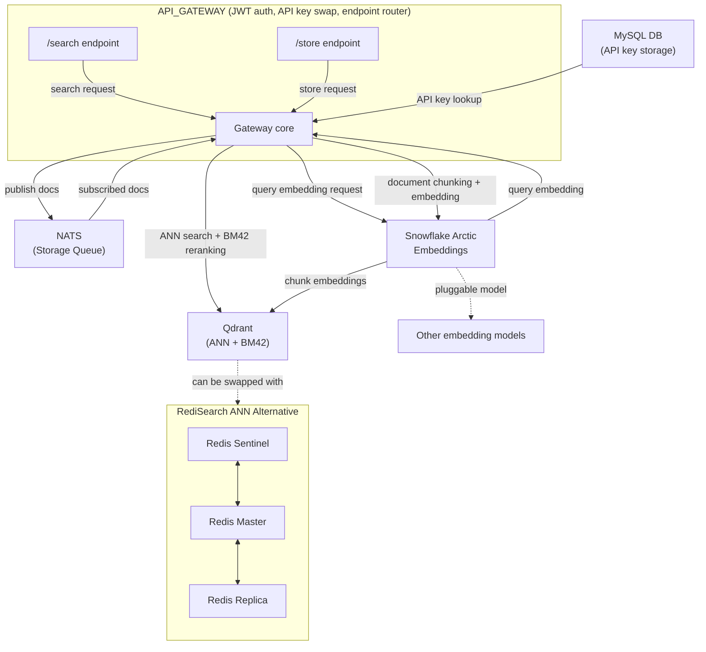

# ThinkPixelInfra

AI-powered search and retrieval-augmented generation (RAG) API Gateway with NATS, Redis, and Qdrant.

## Architecture

Legend / Flow Details:
---
- API_GATEWAY validates JWT (API keys in MySQL, swapped for JWT).
- /search: API_GATEWAY calls SNOWFLAKE ARCTIC model for query embedding (dense/sparse),
            then queries QDRANT DB (ANN SEARCH + RERANKING).
- /store: API_GATEWAY publishes docs to NATS.
            API_GATEWAY (subscribed to NATS) gets doc,
            calls SNOWFLAKE ARCTIC to split and embed,
            stores vectors in QDRANT.
- QDRANT can be swapped for REDIS deployment, but only ANN search.
- SNOWFLAKE ARCTIC is a pluggable embedding model.

## Repo Structure

- `cluster/`: Contains the terraform configuration for building a Kubernetes cluster on Hetzner Cloud.
- `database/`: Contains the database schema and migration files for the MySQL database used by the API gateway.
- `debug/`: Contains debugging tools and scripts for the API gateway.
- `docker/`: Contains Dockerfiles and configurations for dockerized services:
  - `api_gateway/`: The API gateway service.
  - `models`: Contains AI models and their configurations.
    - `mpnetv2/`: Contains the MPNetV2 model files.
    - `snowflake-arctic/`: Contains the Snowflake Arctic model files.
  - `sentinel/`: Contains Redis Sentinel configurations.
  - `wordpress/`: Contains WordPress configurations. Wordpress is used for the admin panel.
- `k8s/`: Contains Kubernetes manifests and configurations for deploying the services. It uses FluxCD for GitOps.
- `local/`: Contains local development configurations and scripts.
  - `mock_site/`: Contains mock site configurations for local development.
